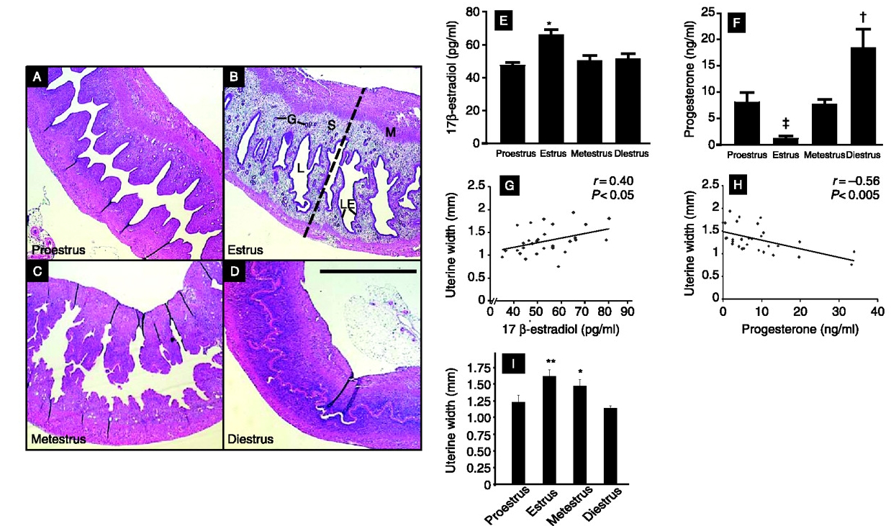
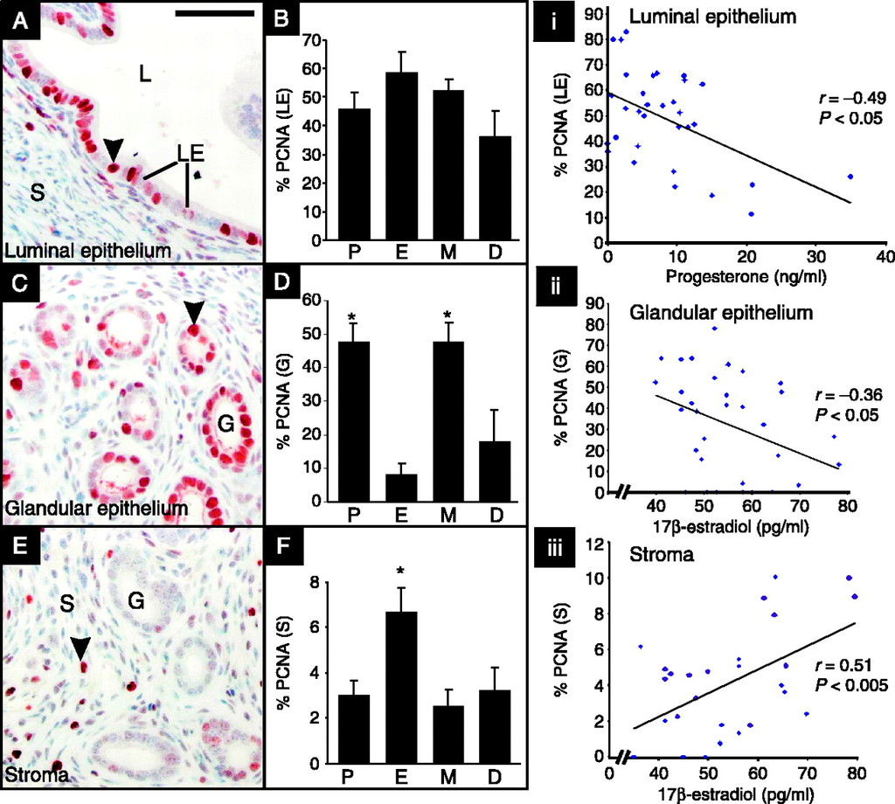
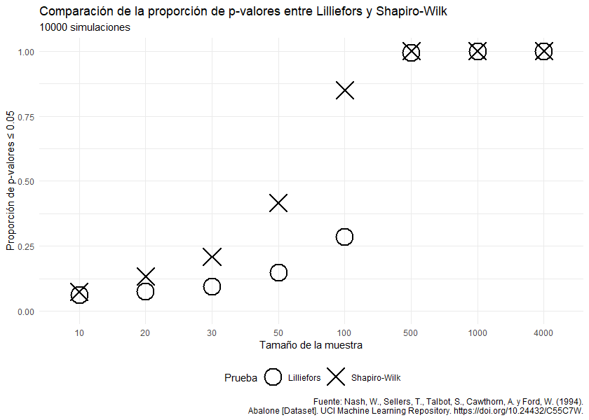
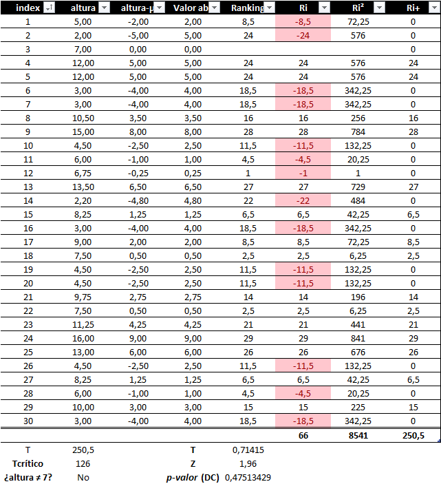
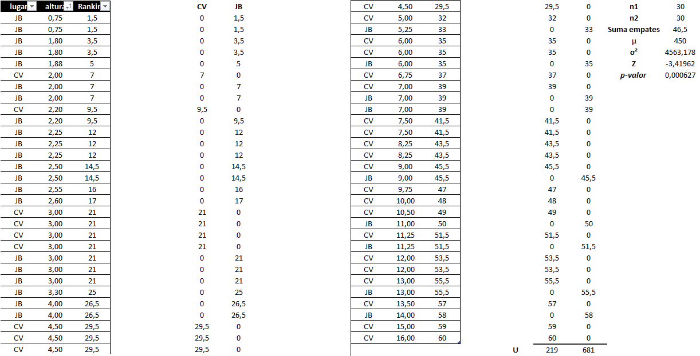
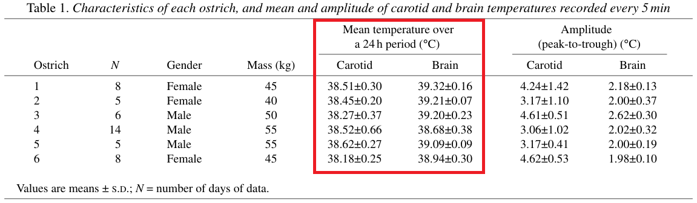

```{r configuracion, include=FALSE}
knitr::opts_chunk$set(echo = TRUE)
library(knitr)
library(tidyverse)
library(fontawesome)
library(emo)
library(kableExtra)
library(xaringanExtra)
library(readxl)
library(coin)

opts_chunk$set(echo=FALSE,
               warning=FALSE,
               collapse = TRUE,
               dpi = 300)
knit_engines$set("yaml", "markdown")

xaringanExtra::use_tile_view()
xaringanExtra::use_clipboard()
xaringanExtra::use_share_again()
xaringanExtra::style_share_again(
  share_buttons = c("twitter", "linkedin", "pocket")
)
```

class: left, middle, inverse, animate__animated, animate__fadeIn
background-image: url(markus-spiske-I-0OS5iRp0Q-unsplash.jpg)
background-size: cover

.pull-left[
# `r rmarkdown::metadata$title` `r fontawesome::fa('chart-simple')`
### `r rmarkdown::metadata$author`
<p style="font-size: 12px;"><em>Imagen de la portada: <a href="https://unsplash.com/es/fotos/palos-de-madera-verdes-y-marrones-I-0OS5iRp0Q" style="color: #D6D6D6; text-decoration: underline;">Markus Spiske</a> en Unsplash. Editado.</em></p>
]

---
class: middle, animate__animated, animate__fadeIn

## Sobre mí `r fontawesome::fa('user')`

.pull-left[
### Formación

- Estudiante de biología (Facultad de Ciencias, UCV).

- 5 años de experiencia en `r fontawesome::fa('r-project')`.

### Experiencia

- Preparador de Laboratorio de Ecología I (I-2023 y I-2024) y Laboratorio de Ecología II (II-2024)

- Asesoramiento académico particular en estadística.
]

.pull-right[
### Otros talleres dictados

- [Iniciación en R para científicos (2022).](https://itsmiguelrojas.github.io/IntroRScientist/)

### Contacto

- [LinkedIn `r fontawesome::fa('linkedin')`: itsmiguelrojas](https://www.linkedin.com/in/itsmiguelrojas/)

- [GitHub `r fontawesome::fa('github')`: itsmiguelrojas](https://github.com/itsmiguelrojas/)

- [Kaggle `r fontawesome::fa('kaggle')`: itsmiguelrojas](https://www.kaggle.com/itsmiguelrojas/)
]

---
class: justify, middle, animate__animated, animate__fadeIn

## Contenido (más o menos...) `r fontawesome::fa('clipboard-list')`

1. Consideraciones iniciales.
2. Prueba de normalidad de Kolmogorov-Smirnov con corrección de Lilliefors y prueba de normalidad de Shapiro-Wilk.
3. Prueba de Levene para homogeneidad de varianzas.
4. Análisis de varianza (ANOVA) y prueba *post hoc* de Tukey.
5. Pruebas no paramétricas:
  - Prueba de suma de rangos de Wilcoxon de una sola muestra.
  - Prueba de Mann-Whitney-Wilcoxon para muestras independientes.
  - Prueba de Wilcoxon para rangos signados.
  - Prueba de Kruskal-Wallis.
6. Regresión lineal, prueba de hipótesis de correlación y prueba de hipótesis de la pendiente.
7. Remuestreo por bootstrapping.

---
class: justify, middle, animate__animated, animate__fadeIn

## ¿Qué vamos a aprender? `r fontawesome::fa('book-open-reader')`

- Evaluar y explorar inicialmente los datos para formular las hipótesis adecuadas.

- Verificar la normalidad de los datos y aprender a aplicar la prueba de Lilliefors y la prueba de Shapiro-Wilk para determinar si un conjunto de datos sigue una distribución normal.

- Evaluar la homogeneidad de varianzas de varios grupos mediante la prueba de Levene.

- Realizar un análisis de varianza para comparar las medias de tres o más grupos y hacer una prueba *post hoc* para identificar cuáles son las diferencias entre los grupos.

- Poner a prueba las hipótesis cuando los datos no cumplen los supuestos de normalidad.

- Comprender los conceptos básicos de la regresión lineal, aprender a ajustar un modelo de regresión y a interpretar los resultados, incluyendo los coeficientes y el $R^2$.

- Calcular y interpretar los coeficientes de correlación de Pearson y Spearman para evaluar la relación entre dos variables.

- Comprender el concepto de bootstrapping y su utilidad en la estimación de intervalos de confianza y p-valores.

---
class: middle, inverse, center, animate__animated, animate__fadeIn
background-image: url(markus-spiske-I-0OS5iRp0Q-unsplash.jpg)
background-size: cover

.pull-left[
### Consideraciones iniciales
]

---
class: justify, animate__animated, animate__fadeIn

## Exploración de datos y planteamiento de hipótesis

Al momento de realizar un experimento o un estudio observacional, es importante recolectar los datos que de este puedan surgir, bien sea mediante instrumentos de medición o por observación directa. Esto nos permitirá después justificar la razón de nuestro estudio.

.pull-left[

]

.pull-right[
Evaluación histológica de secciones sagitales de tejido uterino de ratón adulto teñidas con hematoxilina y eosina derivadas de las cuatro etapas del ciclo estral natural (A-D). Niveles séricos de 17β-estradiol y progesterona en función de la etapa del ciclo estral (E y F). Ancho uterino en función de los niveles séricos de 17β-estradiol y progesterona (G y H). Ancho uterino en función de la etapa del ciclo estral (I). Imagen tomada y modificada de: Wood, G. A., Fata, J. E., Watson, K. L. M. y Khokha, R. (2007). Circulating hormones and estrous stage predict cellular and stromal remodeling in murine uterus. *Reproduction*, **133(5)**: 1035-1044. DOI: [10.1530/REP-06-0302](https://doi.org/10.1530/REP-06-0302).
]

---
class: justify, animate__animated, animate__fadeIn

## Exploración de datos y planteamiento de hipótesis

Al momento de realizar un experimento o un estudio observacional, es importante recolectar los datos que de este puedan surgir, bien sea mediante instrumentos de medición o por observación directa. Esto nos permitirá después justificar la razón de nuestro estudio.

.pull-left[

]

.pull-right[
Proliferación de tipos celulares en el útero de ratón durante el ciclo estral. Estos fueron marcados con anti-PCNA (anti antígeno nuclear de proliferación celular). Imagen tomada de: Wood, G. A., Fata, J. E., Watson, K. L. M. y Khokha, R. (2007). Circulating hormones and estrous stage predict cellular and stromal remodeling in murine uterus. *Reproduction*, **133(5)**: 1035-1044. DOI: [10.1530/REP-06-0302](https://doi.org/10.1530/REP-06-0302).
]

---
class: justify, animate__animated, animate__fadeIn

## Exploración de datos y planteamiento de hipótesis

Es crucial realizar una exploración inicial de los datos recolectados, con el fin de describir patrones generales que muestren el comportamiento. Esto puede lograrse por medio del cálculo de estimadores (promedio, varianza, mediana, moda, etc.) y mediante análisis de gráficos.

La exploración inicial de los datos permite generar hipótesis, que luego pueden ser sometidas a prueba mediante las pruebas estadísticas adecuadas.

Tomado de [Wood y col. (2007)](https://doi.org/10.1530/REP-06-0302):

> #### Statistical analysis
>
> To assess whether differences in the indices for proliferation, apoptosis, basement membrane integrity, and mRNA levels observed at specific stages of the estrous cycle were statistically significant, an ANOVA test was performed on the entire group. If the entire group was significant at P < 0.05, then pairwise comparisons of stage-specific mean values were performed using Fisher’s least significant difference test (LSD). Stages were considered significant if they were in a group that passed the ANOVA test and significantly different from another stage as determined by the LSD test. All values were expressed as the mean ± s.e.m. To determine the degree of linear relationship between various indices, analysis was performed on all mice in the study regardless of estrous stage, and the coefficient of correlation (r) was calculated. The degrees of freedom for all correlation analyses were 31 (since two mice were omitted from analyses related to hormone levels due to serum sample problems).

La interpretación de hallazgos estadísticos debe ser capaz de diferenciar entre **significancia** y **relevancia**, ya que un resultado puede ser estadísticamente significativo sin tener necesariamente un impacto biológico práctico.

---
class: middle, inverse, center, animate__animated, animate__fadeIn
background-image: url(markus-spiske-I-0OS5iRp0Q-unsplash.jpg)
background-size: cover

.pull-left[
### Pruebas de normalidad
]

---
class: justify, animate__animated, animate__fadeIn

## Forma de una distribución

.pull-left[
Normalmente, cuando se conocen todos los datos de una población (o esta es lo suficientemente grande), es fácil visualizar su distribución. Por ejemplo, visualicen esta distribución:

```{r distribucion_1, fig.height=5}
abalone <- read.csv2('datos/abalone.data')

color.p <- c('#7FFFD4','#FA8072','#EEB840','#A27253','#475A56')

abalone %>%
  ggplot(aes(x = whole_weight)) +
  geom_histogram(aes(y = after_stat(density)), bins = 13, color = 'black', fill = color.p[1]) +
  labs(
    x = 'Peso total (g)',
    y = 'Frecuencia',
    title = 'Distribución de peso total de abulones',
    caption = 'Fuente: Nash, W., Sellers, T., Talbot, S., Cawthorn, A. y Ford, W. (1994).\nAbalone [Dataset]. UCI Machine Learning Repository. https://doi.org/10.24432/C55C7W.'
  ) +
  theme_minimal()
```
]

.pull-right[
Estos datos representan la distribución del peso total de abulones (*Haliotis* sp.) para 4177 individuos de la especie, cuya mediana, promedio y desviación estándar son respectivamente:

```{r}
library(sdPop)

matrix(round(c(median(abalone$whole_weight),mean(abalone$whole_weight), sd.population(abalone$whole_weight)), 4), ncol = 3, dimnames = list('',c('Mediana','Promedio','Des. estándar')))
```

Con toda esta información, es fácil darnos cuenta de que los datos están **sesgados**. Otra manera de verlo es a través del valor de la asimetría, que se calcula como:

$\text{Asimetría}=\frac{\sum\limits_{i=1}^{N}\left(X_{i}-\bar{X}\right)^3}{(N)s^3}=\frac{261.3577}{(4177)(0.1178871)}=0.5308$
]

---
class: justify, animate__animated, animate__fadeIn

## Forma de una distribución

.pull-left[
Ahora observemos cómo se verían los datos si fuesen normales, utilizando los valores de promedio y desviación estándar, y comparando la distribución normal generada contra la verdadera distribución:

```{r distribucion_2, fig.height=5}
set.seed(123)
abalone.if.normal <- data.frame(x = rnorm(nrow(abalone), mean(abalone$whole_weight), sd.population(abalone$whole_weight)))

abalone_peso_total_comparado <- cbind(abalone, abalone.if.normal) %>%
  select(whole_weight,x) %>%
  pivot_longer(cols = 1:2, names_to = 'distribucion', values_to = 'peso_total')

abalone_peso_total_comparado$distribucion <- factor(abalone_peso_total_comparado$distribucion, labels = c('Real','Normal'))

abalone_peso_total_comparado %>%
  ggplot(aes(x = peso_total, fill = distribucion)) +
  geom_histogram(aes(y = after_stat(density)), bins = 13, color = 'black', position = 'identity', show.legend = FALSE) +
  labs(
    x = 'Peso total (g)',
    y = 'Frecuencia',
    title = 'Distribución de peso total de abulones',
    subtitle = 'Real vs. normal',
    caption = 'Fuente: Nash, W., Sellers, T., Talbot, S., Cawthorn, A. y Ford, W. (1994).\nAbalone [Dataset]. UCI Machine Learning Repository. https://doi.org/10.24432/C55C7W.'
  ) +
  scale_fill_manual(values = color.p[1:2]) +
  facet_wrap(. ~ distribucion, nrow = 2) +
  theme_minimal()
```
]

.pull-right[
Las comparaciones visuales siempre son una buena manera de inspeccionar nuestros datos para verificar la normalidad. No obstante, existen pruebas de hipótesis destinadas para este propósito. Estas pruebas pueden ser complementadas con un análisis visual.

La mayoría (si no todas) las hipótesis de estas pruebas son por lo general:

$H_{0}:\text{Los datos siguen una distribución normal.}\\H_{a}:\text{Los datos no siguen una distribución normal.}$

<p style="color: #00F;">Veamos dos de estas pruebas →</p>
]

---
class: justify, animate__animated, animate__fadeIn

## Prueba de normalidad de Kolmogorov-Smirnov con corrección de Lilliefors

.pull-left[
**1** Se calculan la media aritmética y la desviación estándar de una muestra aleatoria de tamaño $n$:

$\bar{X}=\frac{\sum\limits_{i=1}^{n}X_{i}}{n}\\s=\sqrt{\frac{\sum\limits_{i=1}^{n}\left(X_{i}-\bar{X}\right)^2}{n-1}}$
  
**2** Se ordenan los datos de forma ascendente.

**3** Se estandarizan los datos.

**4** Se formulan las hipótesis estadísticas:

$H_{0}:\text{Los datos siguen una distribución normal.}\\H_{a}:\text{Los datos no siguen una distribución normal.}$

**5** Se calcula el estadítico de prueba:

$D_{n}=max|F(X)-S_{n}(X)|$
]

.pull-right[
en donde $F(X)$ es la función de distribución normal acumulativa, y $S_{n}(X)$ es la probabilidad de obtener valores menores o iguales a $X_{i}$

**6** Se busca el valor de $W_{\alpha;\: n}$ crítico en la [tabla de Lilliefors](https://real-statistics.com/statistics-tables/lilliefors-test-table/).

**7** Hacer el contraste:

$D_{n} \geq W_{\alpha;\: n}$

Si esta relación se cumple, decimos que **no hay suficiente evidencia para aceptar la hipótesis nula**, y tenemos que ir en favor de la **hipótesis alternativa**. En ese sentido, se dice que **los datos no siguen una distribución normal**.

<p style="color: #00F;">Veamos un ejemplo...</p>
]

---
class: justify, animate__animated, animate__fadeIn

## Prueba de normalidad de Kolmogorov-Smirnov con corrección de Lilliefors - Ejemplo

Tomamos datos aleatorios del peso total de los abulones (por ejemplo, 50 muestras) y los ordenamos de menor a mayor:

```{r}
# Se toman 30 datos aleatorios
set.seed(123)
abalone.muestra <- sample(abalone$whole_weight, size = 50, replace = FALSE)

# Se muestran en pantalla
print(abalone.muestra[order(abalone.muestra)])
```

Calculamos su promedio y desviación estándar:

$\bar{X}=\frac{0.0240+0.0320+ \dots +2.5500}{50}=\frac{37.586}{50}=0.7517\\s=\sqrt{\frac{(0.0240-0.7517)^2+(0.0320-0.7517)^2+ \dots +(2.5500-0.7517)^2}{50-1}}=\sqrt{\frac{12.91892}{49}}=0.5135$

Ahora, se estandarizan los datos mediante la fórmula:

$Z=\frac{X_{i}-\bar{X}}{s}$

---
class: justify, animate__animated, animate__fadeIn

## Prueba de normalidad de Kolmogorov-Smirnov con corrección de Lilliefors - Ejemplo

De esta manera, obtenemos lo siguiente:

```{r}
round((abalone.muestra[order(abalone.muestra)]-mean(abalone.muestra))/sd(abalone.muestra), 3)
```

Con estos valores de $Z$, se buscan los valores de $F(X)$ en la tabla normal:

```{r}
round(pnorm((abalone.muestra[order(abalone.muestra)]-mean(abalone.muestra))/sd(abalone.muestra)), 4)
```

Buscamos también los valores de $S_{n}$:

```{r}
round(1:50/50,4)
```

---
class: justify, animate__animated, animate__fadeIn

## Prueba de normalidad de Kolmogorov-Smirnov con corrección de Lilliefors - Ejemplo

Ahora, se calcula cada valor de $|F(X)-S_{n}(X)|$:

```{r}
round(abs(pnorm((abalone.muestra[order(abalone.muestra)]-mean(abalone.muestra))/sd(abalone.muestra))-1:50/50),4)
```

De aquí, se elige el mayor valor de todos, el cual es:

```{r}
round(max(abs(pnorm((abalone.muestra[order(abalone.muestra)]-mean(abalone.muestra))/sd(abalone.muestra))-1:50/50)),4)
```

Luego, se busca el valor crítico de $W_{\alpha;\:n}$ para $n=50$ y $\alpha=0.05$ en la [tabla de Lilliefors](https://real-statistics.com/statistics-tables/lilliefors-test-table/), el cual es 0.1246. De esta forma, se contrastan ambos valores:

$0.1351 \geq 0.1246$

Lo cual claramente es cierto. Por lo tanto, no hay suficiente evidencia para aceptar $H_{0}$, y debemos optar a favor de $H_{a}$. Por lo tanto, concluimos que los datos **no siguen una distribución normal**.

---
class: justify, animate__animated, animate__fadeIn

## Prueba de normalidad de Kolmogorov-Smirnov con corrección de Lilliefors - Ejemplo

Otra manera de ver esto es a través del p-valor:

```{r}
library(nortest)
lillie.test(abalone.muestra)
```

Esto es fácilmente lograble a través de herramientas computacionales y lenguajes de programación, como R o Python. Esta clase de salidas las veremos a lo largo de la presentación.

<div class="img-container">
  
</div>

---
class: justify, animate__animated, animate__fadeIn

## Prueba de normalidad de Shapiro-Wilk

.pull-left[
**1** Se calculan la media aritmética y la desviación estándar de una muestra aleatoria de tamaño $n$:

$\bar{X}=\frac{\sum\limits_{i=1}^{n}X_{i}}{n}\\s=\sqrt{\frac{\sum\limits_{i=1}^{n}\left(X_{i}-\bar{X}\right)^2}{n-1}}$

**2** Se ordenan los datos de forma ascendente.

**3** Se calcula la suma de los cuadrados de las diferencias (SS):

$SS=\sum\limits_{i=1}^{n}\left(X_{i}-\bar{X}\right)^2$

**4** Se formulan las hipótesis estadísticas:

$H_{0}:\text{Los datos siguen una distribución normal.}\\H_{a}:\text{Los datos no siguen una distribución normal.}$
]

.pull-right[
**5** Se calcula $b$ como se indica a continuación, tomando las ponderaciones $a_{i}$ de la tabla de coeficientes (Tabla 1) en las [tablas de Shapiro-Wilk](https://real-statistics.com/statistics-tables/shapiro-wilk-table/):

$b=\sum\limits_{i=1}^{m}a_{i}\left(X_{n+1-i}-X_{i}\right)$

Si $n$ es par, entonces $m=n/2$. Si $n$ es impar, entonces $m=(n-1)/2$.

**6** Se calcula el estadístico de prueba:

$W=\frac{b^2}{SS}$

**7** Se busca en la Tabla 2 ([tablas de Shapiro-Wilk](https://real-statistics.com/statistics-tables/shapiro-wilk-table/)) el valor que más se acerque a $W$, el cual indica el **p-valor** de la prueba. Para un $\alpha=0.05$, si este valor es mayor o igual, se acepta $H_{0}$. Si no, se opta por $H_{a}$.

<p style="color: #00F;">Vamos con el ejemplo...</p>
]

---
class: justify, animate__animated, animate__fadeIn

## Prueba de normalidad de Shapiro-Wilk - Ejemplo

Tomemos los mismos datos de antes (peso total de abulones), ordenados de forma ascendente:

```{r}
abalone.muestra[order(abalone.muestra)]
```

Ya conocemos su promedio y desviación estándar:

$\bar{X}=0.7517\\s=0.5135$

Como ya conocemos el valor de $s$, es fácil despejar para encontrar $SS$:

$SS=s^2 \times (n-1)=0.5135^2 \times (50-1) = 12.91892$

Ahora, se calcula el valor de $b$:

$m=50/2=25\\b=0.3751\left(2.5500-0.0240\right)+0.2574\left(1.8385-0.0320\right)+ \dots +0.0035\left(0.6015-0.5910\right)=3.452476$

---
class: justify, animate__animated, animate__fadeIn

## Prueba de normalidad de Shapiro-Wilk - Ejemplo

Ahora, solo debemos dividir $b^2$ entre $SS$ para hallar el estadístico de prueba $W$:

$W=\frac{3.452476^2}{12.91892}=0.922646$

A continuación, buscamos el valor aproximado en las [tablas de Shapiro-Wilk](https://real-statistics.com/statistics-tables/shapiro-wilk-table/), específicamente en la Tabla 2:

<div style="height: 150px; overflow: scroll;">
  
</div>

Como vemos, el valor ni siquiera aparece reflejado en la tabla cuando $n=50$, por lo que el p-valor < 0.01. Por lo tanto, concluimos que no tenemos suficiente evidencia para aceptar $H_{0}$, por lo que los datos **no siguen una distribución normal**. Podemos calcular el p-valor a través de R:

```{r}
shapiro.test(abalone.muestra)
```

---
class: justify, animate__animated, animate__fadeIn

## ¿Lilliefors o Shapiro-Wilk? ¿Cuál prueba es mejor?

Todo depende del criterio con que se use, pero en general:

| Característica | Prueba de normalidad de Lilliefors | Prueba de normalidad de Shapiro-Wilk |
|:---:|:---|:---|
| Base estadística | Una modificación de la prueba de Kolmogorov-Smirnov (KS). Compara la función de distribución acumulada (CDF) empírica de la muestra con una distribución normal teórica, donde la media y la desviación estándar se estiman a partir de los datos, mediante un estadístico $D_{n}$. | Una prueba específica de normalidad que compara los valores muestrales ordenados con los estadísticos de orden esperado de una distribución normal. Calcula un estadístico $W$, que es el cociente de dos estimaciones de varianza. |
|Supuestos|Muestras aleatorias independientes, datos continuos.|Muestras aleatorias independientes, datos continuos.|
| Sensibilidad | Generalmente menos potente, especialmente para detectar desviaciones de la normalidad relacionadas con la curtosis. | Considerada ampliamente como la prueba de normalidad más potente, especialmente para muestras de tamaño pequeño a moderado. Es muy sensible a una amplia gama de desviaciones de la normalidad, incluyendo asimetría y curtosis. |
| Tamaño de la muestra | Tradicionalmente se utiliza para muestras más pequeñas, pero se recomienda su uso con tamaños de muestra superiores a 50 donde la prueba de Shapiro-Wilk puede no estar disponible. | Comúnmente utilizado para tamaños de muestra pequeños a medianos ($n<50$). Algunos paquetes de software estadístico restringen su uso para muestras con $n \leq 5000$, lo cual corresponde a la [prueba de Shapiro-Wilk extendida](https://real-statistics.com/tests-normality-and-symmetry/statistical-tests-normality-symmetry/shapiro-wilk-expanded-test/). |
| Uso | Cuando el tamaño de la muestra sea grande ($n > 50$) o cuando el software no ofrezca la prueba de Shapiro-Wilk para el tamaño de muestra específico. También es una buena opción cuando se desea comparar la CDF de sus datos con una distribución teórica. | Primera opción para comprobar la normalidad. Debido a su superior potencia, es la prueba más recomendada en muchas guías estadísticas. |

No obstante, vamos a someterlo a prueba...

---
class: justify, animate__animated, animate__fadeIn

## ¿Lilliefors o Shapiro-Wilk? ¿Cuál prueba es mejor?

<div class="img-container">
  
</div>

---
class: middle, inverse, center, animate__animated, animate__fadeIn
background-image: url(markus-spiske-I-0OS5iRp0Q-unsplash.jpg)
background-size: cover

.pull-left[
### Prueba de homogeneidad de varianzas
]

---
class: justify, animate__animated, animate__fadeIn

## Comparación de distribuciones y varianzas

.pull-left[
Podemos separar la distribución de peso total en tres grupos distintos (machos, hembras e individuos infantes aún sin desarrollar). Si tomamos, por ejemplo, 15 individuos de cada grupo de manera aleatoria, obtenemos los siguientes p-valores para la prueba de Lilliefors y Shapiro-Wilk, así como la varianza:

```{r}
# Convertimos sexo de caracter a factor
abalone$sex <- factor(abalone$sex, levels = c('M','F','I'), labels = c('Macho','Hembra','Infante'))

# Eliminamos outliers y calculamos varianza y p-valores de pruebas de normalidad
set.seed(234)

abalone.sex <- abalone %>%
  mutate(
    Q1 = quantile(whole_weight, 0.25),
    Q3 = quantile(whole_weight, 0.75),
    IQR = IQR(whole_weight),
    lwr = Q1 - 1.5*IQR,
    upr = Q3 + 1.5*IQR
  ) %>%
  filter(whole_weight >= lwr, whole_weight <= upr) %>%
  as_tibble() %>%
  slice_sample(n = 15, by = sex)

abalone.sex %>%
  group_by(sex) %>%
  summarise(
    p.value.l = lillie.test(whole_weight)$p.value,
    p.value.sw = shapiro.test(whole_weight)$p.value,
    var = var(whole_weight)
  )
```

A la luz de las pruebas de normalidad, con un $\alpha=0.05$, la distribución de infantes es no normal, mientras que la de machos y hembras lo es. Asimismo, la varianza de individuos infantes es menor en comparación con los machos y las hembras. Esto se puede verificar con el gráfico de la derecha.

Aunque claramente las varianzas son diferentes, podemos llevar a cabo una prueba homogeneidad de varianzas.
]

.pull-right[
```{r distribucion_3, fig.height=8}
 abalone.sex %>%
  ggplot(aes(x = sex, y = whole_weight, fill = sex)) +
  geom_violin(alpha = 0.5) +
  stat_boxplot(geom = 'errorbar', width = 0.2, linewidth = 1) +
  geom_boxplot(width = 0.1) +
  labs(
    x = '',
    y = 'Peso total (g)',
    title = 'Distribución de peso total de abulones',
    subtitle = 'Dividido por sexo',
    caption = 'Fuente: Nash, W., Sellers, T., Talbot, S., Cawthorn, A. y Ford, W. (1994).\nAbalone [Dataset]. UCI Machine Learning Repository. https://doi.org/10.24432/C55C7W.'
  ) +
  scale_fill_manual(values = c('aquamarine','salmon','#EEB840')) +
  theme_minimal() +
  theme(legend.position = 'none')
```
]

---
class: justify, animate__animated, animate__fadeIn

## Prueba de Levene para homogeneidad de varianzas

.pull-left[
**1** Se establecen las hipótesis:

***H0: Todos los grupos tienen varianzas similares.***

***Ha: Al menos uno de los grupos posee una varianza distinta de las otras.***

**2** Se tienen $k$ grupos, cada uno con un promedio $\bar{X}_{j}$. Se calcula el valor absoluto de la diferencia entre las observaciones de cada grupo y su media correspondiente, conocido como los residuales:

$e_{ij}=|X_{i}-\bar{X}_{ij}|$

**3** Se calcula la suma de los cuadrados entre los grupos ($SSB$) y la suma de los cuadrados dentro de los grupos ($SSW$):

$SSB=\sum\limits_{j=1}^{k}n_{j}\left(\bar{e}_{j}-\bar{e}_{\text{total}}\right)^{2}\\SSW=\sum\limits_{j=1}^{k}\sum\limits_{i=1}^{n}\left(e_{ij}-\bar{e}_{j}\right)^{2}$
]

.pull-right[
**4** Se calcula la media de la suma de los cuadrados entre los grupos ($MSB$) y la media de la suma de los cuadrados dentro de los grupos ($MSW$), con $k-1$ y $n-k$ grados de libertad respectivamente:

$MSB=\frac{SSB}{k-1}\\MSW=\frac{SSW}{n-k}$

**5** Se calcula el estadístico de prueba $F$:

$F=\frac{MSB}{MSW}$

**6** Se busca el valor crítico en la tabla de F de Fisher, con $df_{1}=k-1$ y $df_{2}=n-k$.

**7** Se contrasta el valor crítico contra el estadístico de prueba:

$F \geq F_{df_{1},df_{2},\alpha}$

Si $F$ es mayor o igual que el valor crítico, no se acepta $H_{0}$. Si es menor, se acepta $H_{0}$.
]

---
class: justify, animate__animated, animate__fadeIn

## Prueba de Levene para homogeneidad de varianzas - Ejemplo

.pull-left[
Se tienen 15 observaciones del peso total para cada grupo:

```{r}
abalone.sex %>%
  select(sex, whole_weight) %>%
  group_by(sex) %>%
  mutate(row = row_number()) %>%
  pivot_wider(names_from = sex, values_from = whole_weight) %>%
  select(-row) %>%
  as.data.frame()
```

Se calcula la media para cada grupo:

```{r}
abalone.sex %>%
  select(sex, whole_weight) %>%
  group_by(sex) %>%
  summarise(
    Promedio = round(mean(whole_weight),4)
  ) %>%
  as.data.frame()
```
]

.pull-right[
Una vez calculados los promedios, se restan de cada observación correspondiente y se expresan en su valor absoluto:

```{r}
abalone.residuals <- abalone.sex %>%
  select(sex, whole_weight) %>%
  group_by(sex) %>%
  mutate(
    mean = mean(whole_weight),
    residuales = abs(whole_weight - mean)
  ) %>%
  select(sex, residuales)

abalone.residuals %>%
  group_by(sex) %>%
  mutate(row = row_number()) %>%
  pivot_wider(names_from = sex, values_from = residuales) %>%
  select(-row) %>%
  as.data.frame() %>%
  round(., 4)
```

Se calcula también el promedio total de residuales o $\bar{e}_{\text{total}}$:

```{r}
round(mean(abalone.residuals$residuales), 4)
```
]

---
class: justify, animate__animated, animate__fadeIn

## Prueba de Levene para homogeneidad de varianzas - Ejemplo

Ahora, calculamos $SSB$ y $SSW$. Primero, calculamos los promedios de los residuales de cada grupo:

```{r}
abalone.residuals %>%
  select(sex, residuales) %>%
  group_by(sex) %>%
  summarise(
    Promedio = round(mean(residuales),4)
  ) %>%
  as.data.frame()
```

$SSB=\sum\limits_{j=1}^{k}n_{j}\left(\bar{e}_{j}-\bar{e}_{\text{total}}\right)^{2}=15\left(0.4181-0.3429\right)^{2}+15\left(0.4511-0.3429\right)^{2}+15\left(0.1594-0.3429\right)^{2}\\=\boxed{0.76537}$

$SSW=\sum\limits_{j=1}^{k}\sum\limits_{i=1}^{n}\left(e_{ij}-\bar{e}_{j}\right)^{2}=\left(0.0889-0.4181\right)^{2}+\left(0.6234-0.4511\right)^{2}+\left(0.0004-0.1594\right)^{2}+\dots \\ = \boxed{3.10712}$

A continuación, los dividimos entre $k-1$ y $n-k$ respectivamente, para así obtener $MSB$ y $MSW$:

$MSB=\frac{0.76537}{2}=0.38268\\MSW=\frac{3.10712}{42}=0.07398$

---
class: justify, animate__animated, animate__fadeIn

## Prueba de Levene para homogeneidad de varianzas - Ejemplo

Ahora, calculamos el estadístico $F$:

$F=\frac{MSB}{MSW}=\frac{0.38268}{0.07398}=5.1729$

Buscamos el valor de $F_{\text{crítico}}$, el cual es 3.2199.

Contrastamos ambos valores:

$5.1729 \geq 3.2199$

Lo cual claramente es cierto. Por lo tanto, no tenemos suficiente evidencia para aceptar $H_{0}$. De esta forma, concluimos que al menos una de las distribuciones tiene una varianza distinta.

Sabemos, por el gráfico inmediatamente anterior, que el grupo con varianza no similar es el de infantes. Otra manera de ver esto es mediante una prueba *post hoc* de Tukey:

```
## $sex
##                       diff        lwr         upr     p adj
## Hembra-Macho    0.03294222 -0.2083478  0.27423229 0.9412436
## Infante-Macho  -0.25870667 -0.4999967 -0.01741660 0.0331958
## Infante-Hembra -0.29164889 -0.5329390 -0.05035882 0.0145375
```

Esto lo veremos más adelante en el análisis de varianza (ANOVA).

---
class: justify, animate__animated, animate__fadeIn

## Prueba de Levene para homogeneidad de varianzas - Ejemplo

El número de comparaciones de 2 grupos que vimos anteriormente (Hembra-Macho, Infante-Macho e Infante-Hembra) lo calculamos a través de la fórmula de la combinatoria:

$C_{k}^{2}=\frac{k!}{2!\left(k-2\right)!}$

También podemos visualizar el p-valor y la tabla construida para esta prueba en R (en realidad, es la misma tabla utilizada para el ANOVA):

```{r}
anova(lm(residuales~sex,abalone.residuals))
```

También lo veremos más adelante en el análisis de varianza (ANOVA).

---
class: left, animate__animated, animate__fadeIn

## Prueba de Levene para homogeneidad de varianzas - Resumen

|Característica|Descripción|
|:---:|:---|
|Objetivo|Pone a prueba la $H_{0}$ de que varios grupos tienen varianzas iguales.|
|Supuestos|Supone que las muestras son independientes y se extraen de poblaciones con una distribución continua.|
|Robustez|Más robusto a las desviaciones de la normalidad en comparación con otras pruebas, como la prueba de Bartlett.|
|Estadístico de prueba|Estadístico $F$, basado en las desviaciones absolutas de las observaciones con respecto a las medias o medianas de su grupo.|
|Sensibilidad|	Sensible a tamaños de muestra desiguales; puede manejar grupos con diferentes números de observaciones.|
|Aplicación|Se utiliza comúnmente en ANOVA y análisis de regresión para comprobar el supuesto de homogeneidad de varianzas.|

.pull-left.justify[
Recordar también que la distribución F de Fisher es, en realidad, una familia de distribuciones, construida a partir de dos distribuciones normales, cada una con su promedio y su varianza. En general, para la prueba de Levene, las dos fuentes de varianza provienen de las diferencias entre los grupos ($SSB$) y dentro de los grupos ($SSW$), que constituyen estimadores insesgados de la varianza.
]

.pull-right[

]

---
class: middle, inverse, center, animate__animated, animate__fadeIn
background-image: url(markus-spiske-I-0OS5iRp0Q-unsplash.jpg)
background-size: cover

.pull-left[
### Análisis de varianza (ANOVA)
]

---
class: justify, animate__animated, animate__fadeIn

## Comparar medias de 3 o más grupos

.pull-left[
Ya vimos que la varianza de uno de los grupos es menor, y que además ese mismo grupo posee una distribución no normal. No obstante, podemos realizar un análisis de varianza (ANOVA), aún sabiendo que estos supuestos no se cumplen.

El ANOVA es una prueba que compara las medias de tres o más grupos para determinar si existe una diferencia en al menos una de las medias de los grupos con respecto a las demás.

Si aplicáramos 3 pruebas *t* de Student (sabiendo que son posibles hasta 3 combinaciones distintas de 2 grupos a la vez) para comparar las medias, con un $\alpha=0.05$, **el error tipo I aumentaría hasta un $1 - \left(1-\alpha\right)^{3} \approx 0.14$**. En estos casos, la mejor opción es el ANOVA, ya que permite comparar todas las medias de todos los grupos a la vez.
] 

.pull-right[
```{r distribucion_4, fig.height=8}
 abalone.sex %>%
  ggplot(aes(x = sex, y = whole_weight, fill = sex)) +
  geom_violin(alpha = 0.5) +
  stat_boxplot(geom = 'errorbar', width = 0.2, linewidth = 1) +
  geom_boxplot(width = 0.1) +
  labs(
    x = '',
    y = 'Peso total (g)',
    title = 'Distribución de peso total de abulones',
    subtitle = 'Dividido por sexo',
    caption = 'Fuente: Nash, W., Sellers, T., Talbot, S., Cawthorn, A. y Ford, W. (1994).\nAbalone [Dataset]. UCI Machine Learning Repository. https://doi.org/10.24432/C55C7W.'
  ) +
  scale_fill_manual(values = c('aquamarine','salmon','#EEB840')) +
  theme_minimal() +
  theme(legend.position = 'none')
```
]

---
class: justify, animate__animated, animate__fadeIn

## Análisis de varianza (ANOVA)

.pull-left[
**1** Se establecen las hipótesis:

***H0: Todos los grupos tienen medias similares.***

***Ha: Al menos uno de los grupos posee una media distinta de las otras.***

**2** Se tienen $k$ grupos, cada uno con un promedio $\bar{X}_{j}$. Estos promedios se calculan mediante la fórmula de media aritmética.

**3** Se calcula la suma de los cuadrados entre los grupos ($SSB$) y la suma de los cuadrados dentro de los grupos ($SSW$):

$SSB=\sum\limits_{j=1}^{k}n_{j}\left(\bar{X}_{j}-\bar{X}_{\text{total}}\right)^{2}\\SSW=\sum\limits_{j=1}^{k}\sum\limits_{i=1}^{n}\left(X_{ij}-\bar{X}_{j}\right)^{2}$
]

.pull-right[
**4** Se calcula la media de la suma de los cuadrados entre los grupos ($MSB$) y la media de la suma de los cuadrados dentro de los grupos ($MSW$), con $k-1$ y $n-k$ grados de libertad respectivamente:

$MSB=\frac{SSB}{k-1}\\MSW=\frac{SSW}{n-k}$

**5** Se calcula el estadístico de prueba $F$:

$F=\frac{MSB}{MSW}$

**6** Se busca el valor crítico en la tabla de F de Fisher, con $df_{1}=k-1$ y $df_{2}=n-k$.

**7** Se contrasta el valor crítico contra el estadístico de prueba:

$F \geq F_{df_{1},df_{2},\alpha}$

Si $F$ es mayor o igual que el valor crítico, no se acepta $H_{0}$. Si es menor, se acepta $H_{0}$.
]

---
class: justify, animate__animated, animate__fadeIn

## Análisis de varianza (ANOVA) - Ejemplo

Los pasos son exactamente iguales a los de la prueba de Levene (de hecho, la prueba de Levene está basada en la prueba ANOVA). La única diferencia radica en que, en la prueba de Levene, se trabaja en base a las desviaciones absolutas de las observaciones con respecto al promedio de cada grupo, mientras que aquí estamos comparando los promedios de los grupos y trabajamos con las observaciones directas.

Siendo esto así, solo mostramos el resultado de la tabla:

```{r}
# Modelo lineal
abalone.sex.lm <- lm(whole_weight ~ sex, data = abalone.sex)

# Ver tabla de ANOVA
anova(abalone.sex.lm)
```

Por lo tanto, concluimos, con un $\alpha=0.05$, que al menos una de las medias es diferente.

Pero... ¿cuál de todas las medias?

---
class: justify, animate__animated, animate__fadeIn

## Análisis de varianza (ANOVA) - Ejemplo

#### Prueba de rangos de Tukey

Se utiliza para comparar las diferencias entre medias e interpretar cuáles de ellas son diferentes.

.pull-left[
**1** Se plantean las hipótesis:

$H_{0}:\text{Las medias de ambos grupos son iguales.}\\H_{a}:\text{Las medias de ambos grupos difieren.}$

**2** Se determina cuántas comparaciones de pares de medias han de hacerse mediante la fórmula de la combinatoria:

$C_{k}^{2}=\frac{k!}{2!\left(k-2\right)!}$

**3** Se calcula la diferencia entre medias:

$\bar{X}_{i}-\bar{X}_{j}$

**4** Se calcula el estimador insesgado del error estándar ($SE$):
]

.pull-right[
$SE=\sqrt{\frac{MSW}{n}}$

donde $n$ es el tamaño de cada grupo.

**5** Se calcula el estadístico de prueba $q$:

$q=\frac{\bar{X}_{i}-\bar{X}_{j}}{SE}$

**6** Se busca el valor de $q_{\text{crítico}}$ en la [tabla de rangos $q$ estudentizados](https://real-statistics.com/statistics-tables/studentized-range-q-table/), con $df$ iguales a los de $MSW$.

**7** Se compara cada valor de $q$ contra el $q_{\text{crítico}}$:

$|q| \geq q_{\text{crítico}}$

Con un $\alpha=0.05$, si $q$ es mayor o igual que $q_{\text{crítico}}$, no hay suficiente evidencia para aceptar $H_{0}$.
]

---
class: justify, animate__animated, animate__fadeIn

## Análisis de varianza (ANOVA) - Ejemplo

#### Prueba de rangos de Tukey

Se conoce la media de cada grupo:

$\bar{X}_{\text{Macho}}=1.0329 \\ \bar{X}_{\text{Hembra}}=1.1496 \\ \bar{X}_{\text{Infante}}=0.3539$

También se sabe que pueden hacer hasta $C_{3}^{2}=3$ combinaciones de pares de medias distintas. Se calculan, entonces, las diferencias entre medias:

$\bar{X}_{\text{Hembra}} - \bar{X}_{\text{Macho}} = 0.1167 \\ \bar{X}_{\text{Infante}} - \bar{X}_{\text{Macho}} = -0.6791 \\ \bar{X}_{\text{Infante}} - \bar{X}_{\text{Hembra}} = -0.7957$

Se calcula también $SE$ a partir de $MSW$ y del tamaño $n$ de cada grupo, que es 15:

$SE=\sqrt{\frac{0.21815}{15}}=0.1206$

---
class: justify, animate__animated, animate__fadeIn

## Análisis de varianza (ANOVA) - Ejemplo

#### Prueba de rangos de Tukey

Ahora, se calcula el estadístico de prueba $q$ para cada par de medias:

$\text{Hembra - Macho}:0.9674 \\ \text{Infante - Macho}:-5.6309 \\ \text{Infante - Hembra}:-6.5984$

Cada uno de estos valores se compara contra un $q_{\text{crítico}}$ con un $\alpha=0.05$ y $df=42$ grados de libertad. Si buscamos en la [tabla](https://real-statistics.com/statistics-tables/studentized-range-q-table/), el más cercano que obtenemos es el valor de $df=40$, el cual es 3.442.

$\text{Hembra - Macho}:|0.9674| \geq 3.442$ ❌ (Se acepta $H_{0}$)

$\text{Infante - Macho}: |-5.6309| \geq 3.442$ ✅ (Se rechaza $H_{0}$)

$\text{Infante - Hembra}: |-6.5984| \geq 3.442$ ✅ (Se rechaza $H_{0}$)

Por lo tanto, en los pares **Infante - Macho** e **Infante - Hembra** hay diferencias en la media, y es en estos subgrupos donde no hay suficiente evidencia para aceptar $H_{0}$. Así, se dice que las media del peso total de infantes difiere tanto de la media de machos como de hembras.

---
class: justify, animate__animated, animate__fadeIn

## Análisis de varianza (ANOVA) - Ejemplo

#### Prueba de rangos de Tukey

```{r}
print(TukeyHSD(aov(abalone.sex.lm)))
```

Si los tamaños de los grupos son distintos, la fórmula para calcular $SE$ se convierte en:

$SE=\sqrt{\frac{MSW}{2}\left(\frac{1}{n_{i}}+\frac{1}{n_{j}}\right)}$

El intervalo de confianza se puede calcular como $q_{\text{crítico}}\sqrt{\frac{MSW}{n}}$. Esto nos da la posibilidad de hacer el siguiente gráfico:

---
class: justify, animate__animated, animate__fadeIn

## Análisis de varianza (ANOVA) - Ejemplo

#### Prueba de rangos de Tukey

```{r fig.height=3}
par(mar = c(5.1, 8.1, 4.1, 2.1))
plot(TukeyHSD(aov(abalone.sex.lm)), las = 1, mar = 5)
```

---
class: justify, animate__animated, animate__fadeIn

## Un momento... ¿cómo que hay más de un ANOVA?

| **Tipo de prueba** | **Función** |
|:---:|:---|
| ANOVA de una vía | Compara las medias de tres o más grupos independientes para determinar si al menos uno es diferente. |
| ANOVA de dos vías | Examina el efecto de dos factores independientes sobre una variable dependiente y sus interacciones. |
| ANOVA de medidas repetidas | Compara las medias de varios grupos en diferentes condiciones o momentos en el tiempo. |
| ANOVA de modelo mixto | Combina efectos fijos y aleatorios, permitiendo el análisis de datos con medidas repetidas (factores dentro de sujetos) y grupos independientes (factores entre sujetos). |
| MANOVA | Extensión de ANOVA que analiza múltiples variables dependientes simultáneamente. |
| ANCOVA | Combina ANOVA y regresión, ajustando las medias de los grupos por una o más covariables o variables continuas. |
| PERMANOVA | Variante no paramétrica del ANOVA que evalúa diferencias en la composición de grupos basándose en distancias o disimilitudes entre ellos, calculando posibles rearreglos de los datos observados. |

---
class: middle, inverse, center, animate__animated, animate__fadeIn
background-image: url(markus-spiske-I-0OS5iRp0Q-unsplash.jpg)
background-size: cover

.pull-left[
### Pruebas no paramétricas
]

---
class: justify, animate__animated, animate__fadeIn

## Pruebas no paramétricas

Cuando los supuestos de las pruebas paramétricas (es decir, aquellas que están basadas en parámetros, como la media y la desviación estándar) no se cumplen, sobre todo aquellos concernientes a la distribución de los datos, pueden utilizarse pruebas no paramétricas en su lugar. Por lo general, se usan las **clasificaciones** de las observaciones en vez de las mediciones reales para llevar a cabo estas pruebas.

A pesar de que existen múltiples pruebas no paramétricas, nos vamos a fijar especialmente en estas:

| Prueba de suma de rangos de Wilcoxon de una sola muestra | Prueba de Mann-Whitney-Wilcoxon para muestras independientes | Prueba de Wilcoxon para rangos signados | Prueba de Kruskal-Wallis |
| :--- | :--- | :--- | :--- |
| Se utiliza para evaluar si la mediana de una muestra es diferente de un valor específico. Es especialmente útil cuando los datos no siguen una distribución normal. | Compara dos grupos independientes para determinar si provienen de la misma población. Es una alternativa a la prueba *t* de Student para muestras independientes. | Similar a la prueba de suma de rangos de Wilcoxon de una sola muestra. Se utiliza para comparar dos muestras relacionadas o emparejadas. Es una alternativa a la prueba *t* de Student para muestras relacionadas o pareadas. | Se utiliza para comparar tres o más grupos independientes. Es una alternativa al ANOVA cuando los supuestos de normalidad no se cumplen. |

Veamos cómo funcionan estas pruebas...

---
class: justify, animate__animated, animate__fadeIn

## Prueba de suma de rangos de Wilcoxon de una sola muestra

.pull-left[
**1** Se establecen las hipótesis:

$H_{0}:\:Med=Med_{0}$

$H_{a}:\:Med \neq Med_{0}\\H_{a}:\:Med > Med_{0}\\H_{a}:\:Med < Med_{0}$

**2** Se resta la mediana hipotética ($Med_{0}$) de las observaciones. **Las diferencias cuyo resultado sea cero, se descartan**.

**3** Se expresan las diferencias como valores absolutos.

**4** Se ordenan las diferencias en orden ascendente.

**5** Se clasifican las diferencias (se hace un *ranking*). Si hay empates (valores repetidos), se calcula la posición promedio.

**6** Se vuelven a asignar los signos originales de las diferencias a los *rankings*.
]

.pull-right[
**Primer caso**: Si $n>25$

**7** Se calcula el cuadrado de cada *ranking* ($R_{i}^{2}$).

**8** Se calcula el estadístico de prueba $T$:

$T=\frac{\sum\limits_{i=1}^{n}R_{i}}{\sqrt{\sum\limits_{i=1}^{n}R_{i}^{2}}}\text{ (Si hay empates).}\\T=\sum\limits_{i=1}^{k}R_{i}^{+}\text{ (Si no hay empates).}$

**9** El estadístico de prueba $T$ se compara contra un valor crítico de $Z$ de una tabla normal estandarizada:

$|T| \geq Z_{\frac{\alpha}{2}}\text{ (DC)}\\T \geq Z_{\alpha}\text{ (CD)}\\T \leq -Z_{\alpha}\text{ (CI)}$

Si se cumple alguna de estas propuestas (dependiendo de la direccionalidad de la hipótesis), no se acepta $H_{0}$.
]

---
class: justify, animate__animated, animate__fadeIn

## Prueba de suma de rangos de Wilcoxon de una sola muestra

.pull-left[
**Segundo caso**: Si $n<25$

**7** Se calcula la suma de los *rankings* positivos ($R_{i}^{+}$).

**8** El estadístico de prueba $T$ será:

$T=\sum\limits_{i=1}^{n}R_{i}^{+}$

**9** Se busca el valor de $T_{\text{crítico}}$ en la [tabla de Wilcoxon de rangos signados](https://real-statistics.com/statistics-tables/wilcoxon-signed-ranks-table/), con el valor de $\alpha$ especificado (normalmente 0.05). Las hipótesis se contrastan como:

$T \leq T_{n;\:\alpha} \text{ (DC)}\\T \leq T_{n;\: 2\alpha} \text{ (CD)}\\-T \geq -T_{n;\: 2\alpha} \text{ (CI)}$

**Nota**: Para las pruebas de una sola cola, se duplica el valor de $\alpha$ y se busca en la tabla correspondiente.
]

.pull-right[
Si se cumple alguna de estas propuestas (dependiendo de la direccionalidad de la hipótesis), no se acepta $H_{0}$.
]

---
class: justify, animate__animated, animate__fadeIn

## Prueba de suma de rangos de Wilcoxon de una sola muestra - Ejemplo

Para este caso, se usarán datos provenientes de la medición de individuos vegetales (árboles y arbustos) del [Jardín Botánico de Caracas](https://www.openstreetmap.org/relation/3380028) y de [Cerro El Volcán](https://www.openstreetmap.org/relation/10703464).

```{r}
salida.campo <- read_xlsx('datos/salida_campo.xlsx')

colnames(salida.campo) <- c(
  'individuo',
  'lugar',
  'muerto',
  'cap',
  'dap',
  'area.basal',
  'altura',
  'clase.dap'
)

salida.campo
```

---
class: justify, animate__animated, animate__fadeIn

## Prueba de suma de rangos de Wilcoxon de una sola muestra - Ejemplo

```{r distribucion_5, fig.height=4}
salida.campo %>%
  filter(muerto == 'No') %>%
  ggplot(aes(x = lugar, y = altura, fill = lugar)) +
  geom_violin(alpha = 0.3) +
  stat_boxplot(geom = 'errorbar', width = 0.2) +
  geom_boxplot(width = 0.1, linewidth = 0.5) +
  labs(
    x = 'Lugar',
    y = 'Altura (m)',
    title = 'Distribución de altura de individuos vegetales',
    subtitle = 'Cerro El Volcán (CV) y Jardín Botánico de Caracas (JB)'
  ) +
  scale_fill_manual(values = color.p[1:2]) +
  theme_minimal() +
  theme(legend.position = 'none')
```

---
class: justify, animate__animated, animate__fadeIn

## Prueba de suma de rangos de Wilcoxon de una sola muestra - Ejemplo

Seleccionamos 30 muestras aleatorias de altura (en metros) de individuos de Cerro El Volcán (CV):

```{r}
set.seed(123)

salida.campo.muestra <- salida.campo %>%
  filter(lugar == 'CV', muerto == 'No') %>%
  slice_sample(n = 30) %>%
  select(altura) %>%
  pull(altura)

salida.campo.muestra
```

Cuya mediana en este caso es 7.25 m.

```{r}
median(salida.campo.muestra)
```

---
class: justify, animate__animated, animate__fadeIn

## Prueba de suma de rangos de Wilcoxon de una sola muestra - Ejemplo

Vamos a probar las siguientes hipótesis:

$H_{0}:\: Med = 7\\H_{a}:\: Med \neq 7$

Restamos la mediana propuesta de cada valor de altura:

```{r}
salida.campo.diff <- salida.campo.muestra-7
salida.campo.diff
```

Sacamos su valor absoluto y ordenamos de forma ascendente el valor absoluto de las diferencias (como hay una diferencia igual a 0, la eliminamos):

```{r}
salida.campo.diff.abs <- abs(salida.campo.diff)
salida.campo.diff.abs <- salida.campo.diff.abs[salida.campo.diff.abs > 0]
salida.campo.diff.abs[order(salida.campo.diff.abs)]
```

Clasificamos los datos (*ranking*):

```{r}
c(1,2.5,2.5,4.5,4.5,6.5,6.5,8.5,8.5,11.5,11.5,11.5,11.5,14,15,16,18.5,18.5,18.5,18.5,21,22,24,24,24,26,27,28,29)
```

---
class: justify, animate__animated, animate__fadeIn

## Prueba de suma de rangos de Wilcoxon de una sola muestra - Ejemplo

Reasignamos a cada valor del *ranking* su signo correspondiente:

```{r}
salida.campo.ranking <- c(-1,2.5,2.5,-4.5,-4.5,6.5,6.5,-8.5,8.5,-11.5,-11.5,-11.5,-11.5,14,15,16,-18.5,-18.5,-18.5,-18.5,21,-22,-24,24,24,26,27,28,29)

salida.campo.ranking
```

Se calcula la suma de los *rankings* y la suma de los cuadrados de los *rankings*:

```{r}
salida.campo.ranking %>%
  as_tibble() %>%
  summarise(
    Ri = sum(value),
    Ri_cuadrado = sum(value^2)
  )
```

Se calcula el estadístico $T$:

$T=\frac{66}{\sqrt{8541}}=0.71415$

Esto se compara contra un $Z_{\frac{\alpha}{2}}=1.96$:

$|0.71415| \geq 1.96$

Lo cual, evidentemente, no es cierto. Por lo tanto, tenemos, con un $\alpha=0.05$, suficiente evidencia para aceptar $H_{0}$. Por lo tanto, la mediana de los datos es similar a 7.

---
class: justify, animate__animated, animate__fadeIn

## Prueba de suma de rangos de Wilcoxon de una sola muestra - Ejemplo

A manera de ejemplo, también podemos calcular $R_{i}^{+}$ y compararlo con el $T_{\text{crítico}}$ de la tabla:

$R_{i}^{+}=2.5+2.5+6.5+\dots+29=250.5$

$T_{29; \:0.05}=126$

$250.5 \leq 126$ ❌

Por lo tanto, con un valor de $\alpha=0.05$, tenemos suficiente evidencia para aceptar $H_{0}$. Concluimos que la mediana es similar a 7.
---
class: justify, animate__animated, animate__fadeIn

## Prueba de suma de rangos de Wilcoxon de una sola muestra - Ejemplo

La salida en R para esta prueba es la siguiente:

```{r}
wilcox.test(salida.campo.muestra, mu = 7, exact = F, conf.int = T)
```

---
class: justify, animate__animated, animate__fadeIn

## Prueba de suma de rangos de Wilcoxon de una sola muestra - Ejemplo

También podemos hacer la prueba en Excel, con un poco de ingenio:

<div class="img-container">
  
</div>

---
class: justify, animate__animated, animate__fadeIn

## Prueba de Mann-Whitney-Wilcoxon para muestras independientes

.pull-left[
**1** Se establecen las hipótesis:

$H_{0}:\:Med_{1}=Med_{2}$

$H_{a}:\:Med_{1} \neq Med_{2}\\H_{a}:\:Med_{1} > Med_{2}\\H_{a}:\:Med_{1} < Med_{2}$

**2** Los datos de ambas muestras se unen, debidamente identificados, y se ordenan de forma ascendente.

**3** Se clasifican las diferencias (se hace un *ranking*). Si hay empates (valores repetidos), se calcula la posición promedio.

**4** Se suman los valores del *ranking* 1 ($R_{1}$) y del *ranking* 2 ($R_{2}$).

**5** Se calcula el estadístico $U$ para ambas muestras:

$U_{1}=n_{1}n_{2}+\frac{n_{1}(n_{1}+1)}{2}-R_{1}\\U_{2}=n_{1}n_{2}+\frac{n_{2}(n_{2}+1)}{2}-R_{2}$
]

.pull-right[
**6** Si no hay empates o representan menos del 10% de todos los datos ($n=n_{1}+n_{2}$), el estadístico de prueba $U$ a escoger será:

$U=min(U_{1},U_{2})$

Si la cantidad de empates es igual o supera el 10% de $n$, o si $n_{1}$ y $n_{2}$ son mayores a 20, entonces se hace una correción a $Z$ de la forma:

$Z=\frac{U-\mu}{\sigma}$

en donde:

$\mu=\frac{n_{1}n_{2}}{2}\\ \sigma^{2}=\left(\frac{n_{1}n_{2}}{n^{2}-n}\right)\left(\frac{n^{3}-n}{12}-\sum\limits_{i=1}^{k}\frac{f_{i}^{3}-f_{i}}{12}\right)$

siendo $k$ el número total de empates, $f_{i}$ el número de observaciones que comparten el rango de empate $i$ y $n$ el número total de observaciones.
]

---
class: justify, animate__animated, animate__fadeIn

## Prueba de Mann-Whitney-Wilcoxon para muestras independientes

.pull-left[
**7** Si no hay empates, o son menos del 10%, se busca un valor $U_{\text{crítico}}$ en la [tabla de Mann-Whitney](https://real-statistics.com/statistics-tables/mann-whitney-table/) con el valor de $\alpha$ especificado (normalmente 0.05). Los valores se contrastan de la siguiente forma:

$U \leq U_{n; \:\alpha} \text{ (DC)}$

Si la prueba es de una sola cola, se duplica el valor de $\alpha$ y se busca el valor de $U_{\text{crítico}}$ en la tabla correspondiente:

$U \leq U_{n; \: 2 \alpha} \text{ (CD)}\\-U \geq -U_{n; \: 2 \alpha} \text{ (CI)}$

Si los valores de $n_{1}$ y $n_{2}$ son mayores a 20, el estadístico de prueba se cambia por $Z$, tal y como está descrito en el paso 6:

$|Z| \geq Z_{\frac{\alpha}{2}} \text{ (DC)}\\Z \geq Z_{\alpha} \text{ (CD)}\\Z \leq -Z_{\alpha} \text{ (CI)}$
]

.pull-right[
Si alguno de los contrastes para $U$ o para $Z$ se cumple (dependiendo de la direccionalidad de la prueba), entonces se dice que no se puede aceptar $H_{0}$.

**Propiedades importantes a tener en cuenta**

1. **Propiedad 1**:

  $U_{1}+U_{2}=n_{1}n_{2}$
  
2. **Propiedad 2**: Para unos $n_{1}$ y $n_{2}$ lo suficientemente grandes, el estadístico $U$ se distribuye de manera aprox. normal ($\mathcal{N}(\mu,\sigma^{2})$), tal que

  $\mu=\frac{n_{1}n_{2}}{2}\\ \sigma^{2}=\frac{n_{1}n_{2}(n_{1}+n_{2}+1)}{12}$
  
3. **Propiedad 3**: Si el número de empates es superior al 10% de $n$, entonces:

  $\sigma^{2}=\left(\frac{n_{1}n_{2}}{n^{2}-n}\right)\left(\frac{n^{3}-n}{12}-\sum\limits_{i=1}^{k}\frac{f_{i}^{3}-f_{i}}{12}\right)$
]

---
class: justify, animate__animated, animate__fadeIn

## Prueba de Mann-Whitney-Wilcoxon para muestras independientes - Ejemplo

Pondremos a prueba las hipótesis:

$H_{0}:Med_{CV}=Med_{JB}\\H_{a}:Med_{CV} \neq Med_{JB}$

Usaremos las mismas 30 muestras de altura para individuos vegetales de Cerro El Volcán (CV), y adicionalmente vamos a escoger 30 muestras aleatorias para el Jardín Botánico.

```{r}
# Alturas CV
alt.cv.sample <- salida.campo.muestra

# Alturas JB
alt.jb <- salida.campo %>%
  filter(lugar == 'JB', muerto == 'No') %>%
  pull(altura)

set.seed(123)

alt.jb.sample <- alt.jb %>%
  as_tibble() %>%
  slice_sample(n = 30) %>%
  pull()

# Tibble con datos de ambas locaciones
salida.campo.mw <- tibble(
  lugar = factor(rep(c('CV','JB'), each = 30)),
  altura = c(alt.cv.sample, alt.jb.sample)
)
```

**Cerro El Volcán (CV)**:

```{r}
salida.campo.mw %>%
  filter(lugar == 'CV') %>%
  pull(altura)
```

**Jardín Botánico de Caracas (JB)**:

```{r}
salida.campo.mw %>%
  filter(lugar == 'JB') %>%
  pull(altura)
```

Cuyas medianas son respectivamente 7.25 m (CV) y 2.80 m (JB).

---
class: justify, animate__animated, animate__fadeIn

## Prueba de Mann-Whitney-Wilcoxon para muestras independientes - Ejemplo

Unimos los datos de ambas muestras y los ordenamos de forma ascendente, manteniendo la identificación de cada una:

```{r}
salida.campo.mw.vector <- salida.campo.mw %>%
  pull(altura)

names(salida.campo.mw.vector) <- salida.campo.mw %>%
  pull(lugar)

salida.campo.mw.vector <- salida.campo.mw.vector[order(salida.campo.mw.vector)]

salida.campo.mw.vector
```

---
class: justify, animate__animated, animate__fadeIn

## Prueba de Mann-Whitney-Wilcoxon para muestras independientes - Ejemplo

De esta forma, se crea el siguiente *ranking*:

```{r}
cv.ranking <- c(7,9.5,21,21,21,21,29.5,29.5,29.5,29.5,32,35,35,37,39,41.5,41.5,43.5,43.5,45.5,47,48,49,51.5,53.5,53.5,55.5,57,59,60)

jb.ranking <- c(1.5,1.5,3.5,3.5,5,7,7,9.5,12,12,12,14.5,14.5,16,17,21,21,21,25,26.5,26.5,33,35,39,39,45.5,50,51.5,55.5,58)

cv.jb.ranking <- c(cv.ranking, jb.ranking)
cv.jb.ranking <- cv.jb.ranking[order(cv.jb.ranking)]

names(cv.jb.ranking) <- names(salida.campo.mw.vector)

cv.jb.ranking
```

**Cerro El Volcán (CV)**:

```{r}
cv.ranking
```

**Jardín Botánico de Caracas (JB)**:

```{r}
jb.ranking
```

---
class: justify, animate__animated, animate__fadeIn

## Prueba de Mann-Whitney-Wilcoxon para muestras independientes - Ejemplo

Con cada uno de los *rankings* separados, calculamos su suma:

$R_{1}=7+9.5+21+\dots+60=1146\\R_{2}=1.5+1.5+3.5+\dots+58=684$

Calculamos $U$ para cada grupo:

$U_{1}=(30)(30)+\frac{30(30+1)}{2}-1146=219\\U_{2}=(30)(30)+\frac{30(30+1)}{2}-684=681$

Como $n_{1}$ y $n_{2}$ son mayores a 20, debemos hacer una aproximación a la normal por medio de $Z$. Para ello, debemos calcular $\mu$ y $\sigma$:

$\mu=\frac{(30)(30)}{2}=450$

Para calcular $\sigma$, debemos contar el número de empates...

---
class: justify, animate__animated, animate__fadeIn

## Prueba de Mann-Whitney-Wilcoxon para muestras independientes - Ejemplo

.pull-left[
Hay un total de $k=17$ grupos con empates:

- 1.5: 2 empates.
- 3.5: 2 empates.
- 7: 3 empates.
- 9.5: 2 empates.
- 12: 3 empates.
- 14.5: 2 empates.
- 21: 7 empates.
- 26.5: 2 empates.
- 29.5: 4 empates.
- 35: 3 empates.
- 39: 3 empates.
- 41.5: 2 empates.
- 43.5: 2 empates.
- 45.5: 2 empates.
- 51.5: 2 empates.
- 53.5: 2 empates.
- 55.5: 2 empates.
]

.pull-right[
Por lo tanto:

$\sum\limits_{i=1}^{17}\frac{f_{i}^{3}-f_{i}}{12}=\frac{1}{12}\left((2^{3}-2)+(2^{3}-2)+(3^{3}-3)+\dots\right)\\=46.5$

$\sigma^{2}=\left(\frac{(30)(30)}{60^{2}-60}\right)\left(\frac{60^{3}-60}{12}-46.5\right)=4563.178$

Así, el valor del estadístico $Z$ es:

$Z=\frac{219-450}{\sqrt{4563.178}}=-3.41962$

Comparamos este valor contra un $Z_{\text{crítico}}$ de 1.96:

$|-3.41962| \geq 1.96$ ✅

Por lo tanto, no tenemos suficiente evidencia para aceptar $H_{0}$. Concluimos que la diferencia entre alturas de individuos vegetales de CV y JB es distinta.
]

---
class: justify, animate__animated, animate__fadeIn

## Prueba de Mann-Whitney-Wilcoxon para muestras independientes - Ejemplo

Más R:

```{r}
wilcox_test(altura ~ lugar, data = salida.campo.mw)
```

---
class: justify, animate__animated, animate__fadeIn

## Prueba de Mann-Whitney-Wilcoxon para muestras independientes - Ejemplo

Y más Excel:

<div class="img-container">
  
</div>

---
class: justify, animate__animated, animate__fadeIn

## Prueba de Wilcoxon para rangos signados

Es similar a la prueba de suma de rangos de Wilcoxon para una sola muestra, y se procede de la misma manera que esta. Lo único diferente es:

1. En vez de contrastar dos grupos independientes, se contrastan dos grupos pareados **provenientes de la misma unidad muestral**.

2. Se pone a prueba la hipótesis nula de que la mediana de las diferencias es cero:

  $H_{0}:Med_{d}=0$
  
  $H_{a}:Med_{d} \neq 0\\H_{a}:Med_{d} \geq 0\\H_{a}:Med_{d} \leq 0$

3. Se hace un *ranking* de las diferencias entre las muestras, no de las observaciones individuales.

4. Se calcula la suma de los *rankings* tanto positivos ($R_{i}^{+}$) como negativos ($R_{i}^{-}$). El estadístico de prueba $T$ será el mínimo entre ambos:

  $T=min(R_{i}^{+},R_{i}^{-})$

---
class: justify, animate__animated, animate__fadeIn

## Prueba de Wilcoxon para rangos signados - Ejemplo

Para este ejemplo usaremos los datos de [Fuller y col. (2003)](https://doi.org/10.1242/jeb.00230) sobre la variabilidad de la temperatura arterial y cerebral de avestruces:

<div class="img-container">
  
</div>

En este caso, tenemos $n=6$ avestruces, a cada una de las cuales se les midió la temperatura en la arteria carótida y en el cerebro, en un período de 24 horas.

---
class: justify, animate__animated, animate__fadeIn

## Prueba de Wilcoxon para rangos signados - Ejemplo

Planteamos las hipótesis:

$H_{0}:Med_{d}=0\\H_{a}:Med_{d} \neq 0$

O alternativamente:

$H_{0}:Med_{\text{Cerebro}}-Med_{\text{Carótida}}=0\\H_{a}:Med_{\text{Cerebro}}-Med_{\text{Carótida}} \neq 0$

Calculamos las diferencias entre temperaturas:

```{r}
carotid <- c(38.51,38.45,38.27,38.52,38.62,38.18)
brain <- c(39.32,39.21,39.20,38.68,39.09,38.94)

diff.temp <- brain - carotid

diff.temp
```

Ordenamos las diferencias de forma ascendente:

```{r}
diff.temp[order(diff.temp)]
```

Con esto, obtenemos el siguiente *ranking*:

```{r}
diff.temp.ranking <- c(1,2,3.5,3.5,5,6)
diff.temp.ranking
```

Como solo hay valores positivos, no hace falta hacer asignar signos a los *rankings*.

---
class: justify, animate__animated, animate__fadeIn

## Prueba de Wilcoxon para rangos signados - Ejemplo

Para una aproximación normal, calculamos la suma de los *rankings* y de sus cuadrados:

$\sum\limits_{i=1}^{6}R_{i}=1+2+3.5+3.5+5+6=21\\ \sum\limits_{i=1}^{6}R_{i}^{2}=1+4+12.25+12.25+25+36=90.5$

Y luego calculamos el estadístico de prueba $T$:

$T=\frac{\sum\limits_{i=1}^{6}R_{i}}{\sqrt{\sum\limits_{i=1}^{6}R_{i}^{2}}}=\frac{21}{\sqrt{90.5}}=2.2075$

Lo comparamos contra un valor de $Z_{\text{crítico}}$ de 1.96:

$2.2075 \geq 1.96$ ✅

Por lo tanto, no tenemos suficiente evidencia para aceptar $H_{0}$, y concluimos diciendo hay una diferencia en la temperatura de la carótida y el cerebro de las avestruces luego de un período de 24 horas.

---
class: justify, animate__animated, animate__fadeIn

## Prueba de Wilcoxon para rangos signados - Ejemplo

Pero ya que $n<25$, buscamos la suma de los *rankings* positivos ($R_{i}^{+}$) y negativos ($R_{i}^{-}$):

$\sum\limits_{i=1}^{6}R_{i}^{+}=21\\\sum\limits_{i=1}^{6}R_{i}^{-}=0$

De esta manera, el estadístico de prueba $T$ es:

$T=min(R_{i}^{+},R_{i}^{-})=0$

Buscamos el valor de $T_{\text{crítico}}$ en la [tabla de Wilcoxon de rangos signados](https://real-statistics.com/statistics-tables/wilcoxon-signed-ranks-table/) para un valor de $\alpha=0.05$ y $n=6$, el cual es:

$T_{\text{crítico}}=0$

Luego, contrastamos ambos valores:

$0 \leq 0$ ✅

Por lo tanto, no tenemos suficiente evidencia para aceptar $H_{0}$, y concluimos lo mismo de antes.